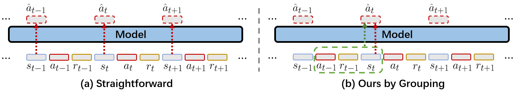
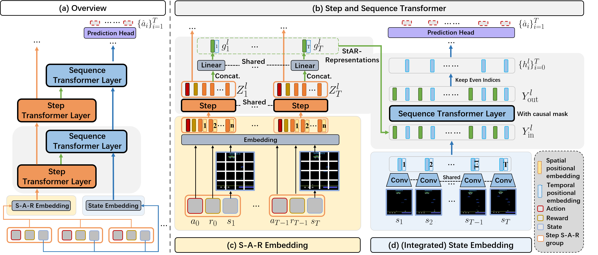
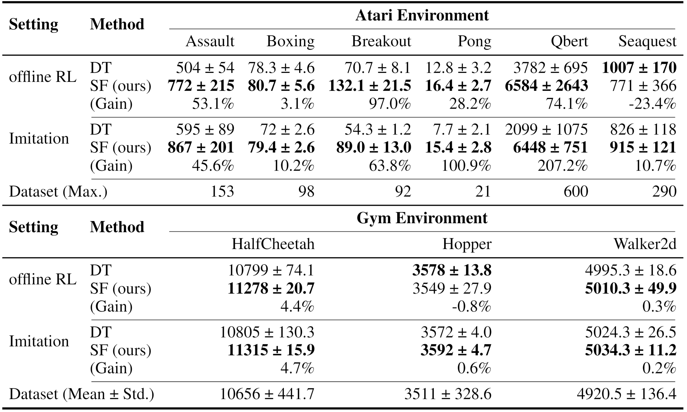

# StARformer
This repository contains the PyTorch implementation for our paper titled [StARformer: Transformer with State-Action-Reward Representations](https://arxiv.org/abs/2110.06206).

We learn local State-Action-Reward representations (StAR-representations) to improve (long) sequence modeling for reinforcement learning (and imitation learning).




## Results



## Installation

Dependencies can be installed by Conda:

```
conda env create -f conda_env.yml
```

Then activate it by

```
conda activate star-atari
```

And [install Atari ROMs](https://github.com/openai/atari-py#roms) for the environment.

## Datasets
Please follow [this instruction](https://github.com/kzl/decision-transformer/blob/master/atari/readme-atari.md#downloading-datasets) for datasets.


## Example usage

See `run.sh` or below:
```
python run_star_atari.py --seed 123 --data_dir_prefix [data_directory] --epochs 10 --num_steps 500000 --num_buffers 50 --batch_size 64 --seq_len 30 --model_type 'star' --game 'Breakout'
```
`[data_directory]` is where you place the Atari dataset.

### Variants (`model_type`):
 - `'star'` (imitation)
 - `'star_rwd'` (offline RL)
 - `'star_fusion'` (see Figure 4a in our paper)
 - `'star_stack'` (see Figure 4b in our paper)

## Citation
```
@misc{shang2021starformer,
      title={StARformer: Transformer with State-Action-Reward Representations}, 
      author={Jinghuan Shang and Michael S. Ryoo},
      year={2021},
      eprint={2110.06206},
      archivePrefix={arXiv},
      primaryClass={cs.LG}
}
```

## Acknowledgement

This code is based on [Decision-Transformer](https://github.com/kzl/decision-transformer/).
