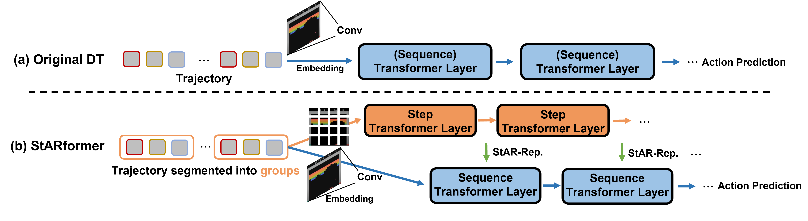
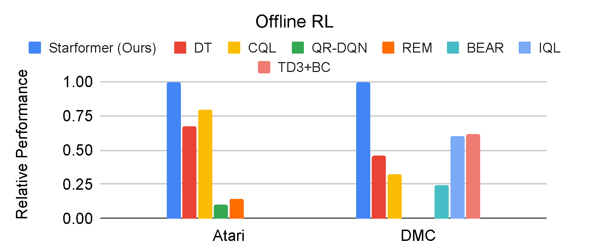
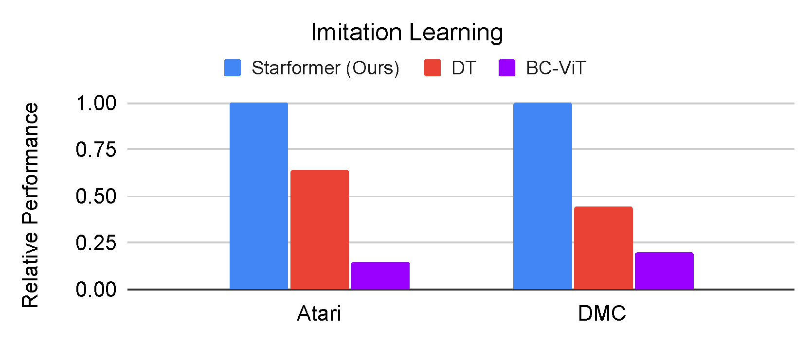
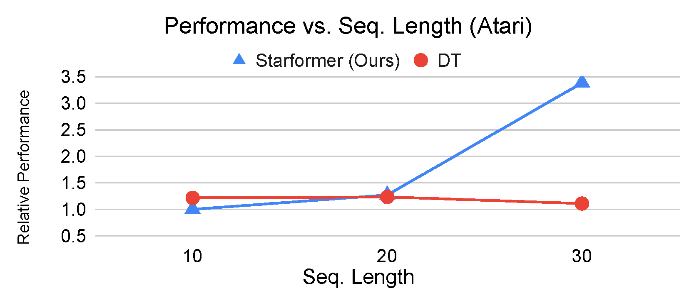
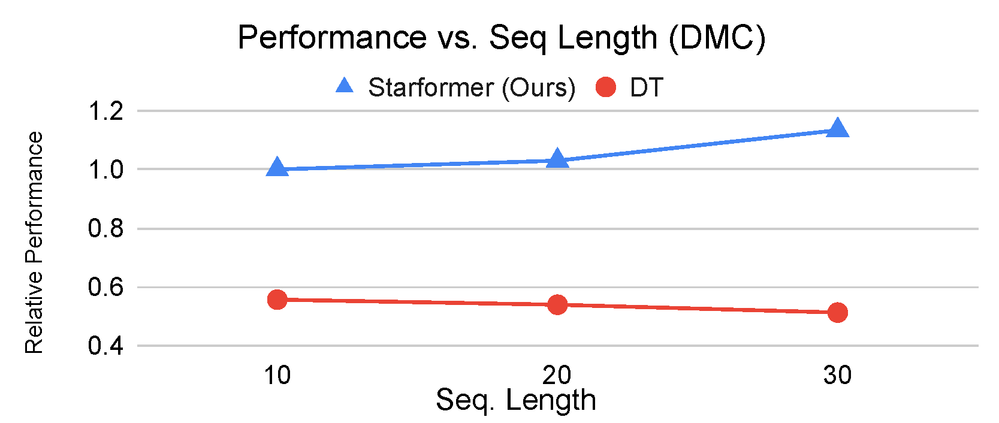

# StARformer
This repository contains the PyTorch implementation for our paper titled [StARformer: Transformer with State-Action-Reward Representations](https://arxiv.org/abs/2110.06206) (ECCV 2022) and [StARformer: Transformer with State-Action-Reward Representations for Robot Learning](https://www3.cs.stonybrook.edu/~jishang/starformer/Starformer_TPAMI_final.pdf) (IEEE T-PAMI).

## Quick Links
[[Installation]](#installation) [[Usage]](#example-usage) [[Citation]](#citation) [[Update Notes]](#update-notes)

## Introduction
We learn local State-Action-Reward representations (StAR-representations) to improve (long) sequence modeling for reinforcement learning (and imitation learning).




## Results
<table style="padding: 0; border-spacing: 0;">
<tr style="padding: 0; border-spacing: 0;">
<td style="padding: 0; border-spacing: 0; width: 50%"></td>
<td style="padding: 0; border-spacing: 0; width: 50%"></td>
</tr>

<tr style="padding: 0; border-spacing: 0;">
<td style="padding: 0; border-spacing: 0; width: 50%"></td>
<td style="padding: 0; border-spacing: 0; width: 50%"></td>
</tr>
</table>


## Installation
Dependencies can be installed by Conda:

For example to install env used for Atari and DMC (image input):
```
conda env create -f atari_and_dmc/conda_env.yml
```

Then activate it by
```
conda activate starformer
```

- Atari: 
To run on atari environment, please [install Atari ROMs](https://github.com/openai/atari-py#roms).

- DMC: 
Install [dmc2gym](https://github.com/denisyarats/dmc2gym) by 
```
pip install git+https://github.com/denisyarats/dmc2gym.git
```

Make sure you have [MuJoCo](https://github.com/deepmind/mujoco) installed. `mujoco-py` has already been installed in the conda env for you, but it's good to check whether they two are compatible.


## Datasets (Atari)
Please follow [this instruction](https://github.com/kzl/decision-transformer/blob/master/atari/readme-atari.md#downloading-datasets) for datasets.


## Example usage

See `run.sh` or below:
- atari:
```
python run_star_atari.py --seed 123 --data_dir_prefix [data_directory] --epochs 10 --num_steps 500000 --num_buffers 50 --batch_size 64 --seq_len 30 --model_type 'star' --game 'Breakout'
```
`[data_directory]` is where you place the [Atari dataset](#datasets-atari).

- dmc:
```
python run_star_dmc.py --seed 123 --data_dir_prefix [data_directory] --epochs 10 --seq_len 30 --model_type 'star' --batch_size 64 --domain ball_in_cup --task catch --lr 1e-4
```
similarly, `[data_directory]` is where you place the DMC dataset. You can collect any replay buffer you desire and modify `StateActionReturnDatasetDMC` in `run_star_dmc.py` to make it compatible with your buffers.

### Variants (`model_type`):
 - `'star'` (imitation)
 - `'star_rwd'` (offline RL)
 - `'star_fusion'` (see Figure 4a in our paper)
 - `'star_stack'` (see Figure 4b in our paper)

## Citation
If you find our paper useful for your research, please consider cite 
```

@InProceedings{starformer,
  author="Shang, Jinghuan and Kahatapitiya, Kumara and Li, Xiang and Ryoo, Michael S.",
  title="StARformer: Transformer with State-Action-Reward Representations for Visual Reinforcement Learning",
  booktitle="Computer Vision -- ECCV 2022",
  year="2022",
  publisher="Springer Nature Switzerland",
  pages="462--479",
}


@ARTICLE{starformer-robot,
  author={Shang, Jinghuan and Li, Xiang and Kahatapitiya, Kumara and Lee, Yu-Cheol and Ryoo, Michael S.},
  journal={IEEE Transactions on Pattern Analysis and Machine Intelligence}, 
  title={StARformer: Transformer with State-Action-Reward Representations for Robot Learning}, 
  year={2022},
  pages={1-16},
  doi={10.1109/TPAMI.2022.3204708}
}
```

## Update Notes
* Nov 26, 2022: 
  - update code for dmc envrionments
  - clean conda env file

## Acknowledgement

This code is based on [Decision-Transformer](https://github.com/kzl/decision-transformer/).
